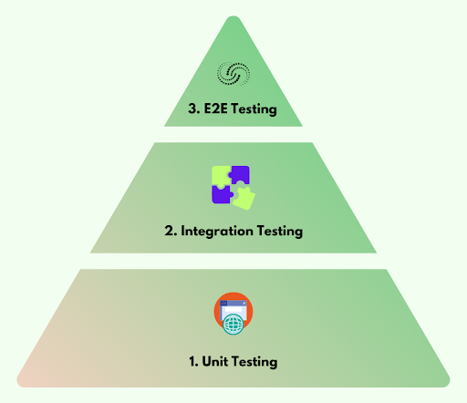
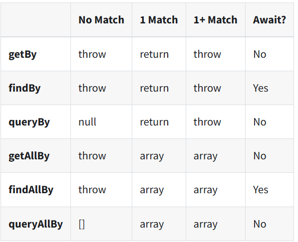

# React.js
* React is a JavaScript library used to build fast, interactive user interfaces (UI) for web applications, focusing on `component-based architecture`.
JSX is a syntax extension that allows you to write HTML-like code in JavaScript, which is then compiled into standard JavaScript.

```
servlet , jsp

angular 
    angular.js => v1 (controller based - MVC) , v2 angular,v4,v5,
```

react - MVC, component - v16 - next.js(ssr) , 18,19 (SSR)

component    
    functional component - function - state management  - hooks (javascript) 
    class component - class - manage state - java 

JSX = 
react component - with js => createComponent()
react component - with jsx => js code + html code


## Functional Component and Props

* Functional components in React are JavaScript functions that return JSX and are used to build UI components.

* Props allow you to pass data from one component to another, enabling dynamic content in your application.


## State Management with Hooks
* The `useState` hook allows functional components to manage and update state in React.
* By using `event handlers` like `onClick` and `onChange`, you can capture user interactions and trigger state updates.


## Component Lifecycle and Forms in Functional Components

### Demo - Passing data between component

parent component -> child component
parent component <- child component


### useEffect
* The `useEffect` hook allows you to handle side effects like data fetching, API calls, or subscriptions in functional components.

* It runs after the component renders and can clean up side effects when the component unmounts or re-renders.


### Rule for Hooks
useState or useEffect hooks are should be placed first statement of fun. component


### Conditional Rendering and List
* Conditional rendering allows us to show or hide components dynamically based on certain conditions, like state or props.

* Lists can be rendered efficiently using .map() in React, and each item in the list should have a unique key prop for better performance.


## Handling Forms and Input State with useState
### Note
* React forms can be either controlled (where React controls the input values) or uncontrolled (where the DOM controls the input values).  

* We manage form input state using the `useState` hook to track and handle user input and form submissions.  

### Controlled Components:
- A controlled component in React is where form data is handled by the React component state.  

- The input value is bound to a state variable and updates via an onChange event handler.  

- The component actively controls the form fields' behavior, and data is managed entirely by React.  

#### Advantages:
* Easier to validate and manipulate form data.  
* Provides real-time updates as the user types.  
* Good for more complex form logic (e.g., input validation). 

#### Example
```jsx
const [username, setUsername] = useState('');

<input type="text" value={username} onChange={(e) => setUsername(e.target.value)} />
```


### Uncontrolled Components:
* An uncontrolled component uses the `DOM` itself to manage form data, not the React state.  

* The input’s value is accessed only when needed, often through `refs` or `event.target.elements` in a form submit handler.

* React doesn’t manage or track the form data until the form is submitted.  

#### Advantages:
Simple for quick forms that don't need real-time updates.  
Better for legacy forms or when migrating older HTML code.  


<input type="text" name="username" />


## Advanced React Hooks
* `useRef` manages references to DOM elements and persistent values without causing re-renders.  

* `useReducer` handles complex state logic efficiently, especially when managing multiple related state values.  

### What is useReducer
* useReducer is a React hook that lets you manage more complex state logic than useState.   

* It's especially useful when:

* You have multiple related pieces of state (e.g., a form with multiple fields like username and password).  

* You need to handle multiple types of actions that affect the state (e.g., setting a value, resetting a form, etc.).  

* You want better control over how your state is updated, similar to how Redux works (but simpler).  


### Why
Why use useReducer over useState?

useState is great for simple scenarios where you’re managing one or two state   
values, but when things get more complex, useReducer is a better choice.  

### When to use useState:

When you only need to manage a few simple state values.  
Example: Tracking the value of a single input field.  

### When to use useReducer

When you have multiple pieces of state that are related.  
When the state transitions depend on the type of actions  
(e.g., setting values, resetting form fields).  
When you want to make your state logic easier to read and maintain, especially as your app grows.  

### How does useReducr Work?
It’s similar to useState, but with more structured control.  
Instead of calling a setState function directly (like in useState), you use a dispatch function to send an action.  
The action tells the reducer how to update the state.  


---

* useState gives you a state value and a way to update it (setState).

* useReducer gives you a state value and a function (dispatch) to trigger specific updates through a reducer function that decides how to change the state.

-----

## Custom Hook
A custom hook allows you to encapsulate and reuse logic across multiple components, keeping your code DRY (Don't Repeat Yourself).  


## Context API
* The `Context` API solves the `prop drilling` problem by allowing global state sharing across components without passing props manually.  

* `useContext` helps consume the global state in functional components.  

## Performance Optimization in React
* Unnecessary `re-renders` can slow down React applications, affecting performance.  
* Optimizations like `React.memo`, `useMemo`, and `useCallback` help avoid redundant re-renders and re-calculations, improving efficiency.  

`React.memo`: It prevents child components from re-rendering unless their props have changed, which is useful when components receive props that rarely change.  

`useMemo`: It memoizes expensive calculations, so React doesn't recompute them unnecessarily on every render.

`useCallback`: It memoizes functions, preventing them from being recreated every time the component re-renders.

<hr />

## Routing
* react-router   - 
* reach-router   - easy to use

* Reach Router is a lightweight router for React that focuses on accessibility and ease of use.
* It allows for simple, declarative navigation between pages in single-page applications.

### Demo - reach router
**Note** Ensure your react version is 16 (react router will work only till 16th version of react)
1. Install `npm install @reach/router`   
2. Setup routing in react app using <Router>  
3. Create basic routes for different pages  
4. Navigate between pages using <Link> and `navigate` function   
#### app.js
```js
import { Router, Link } from '@reach/router';


.....


      <div align="right">
        <Link to="/">Home</Link>  <Link to="/about">About</Link>   |   <Link to="/contact">Contact</Link>

      </div>
      <hr />
      <Router>
        <Home path="/" />
        <About path="/about" />
        <Contact path="/contact" />
      </Router>

      <h3 style={{ marginTop: 300 }}>Footer Page</h3>
```

#### Home.js
```js
import { Link, navigate } from '@reach/router'
import React from 'react'

export default function Home() {
    return (
        <div>
            <h3>Home Page</h3>
        </div>
    )
}

```

#### about.js
```js
import { navigate } from '@reach/router'
import React from 'react'

export default function About() {
    return (
        <div><h3>About Us</h3>

            <button onClick={() => navigate('/')}>goto home</button>
        </div>
    )
}
```
#### contact.js
```js
import { navigate } from '@reach/router'
import React from 'react'

export default function Contact() {
  return (
    <div><h3>Contact Page</h3>
        <button onClick={() => navigate('/')}>goto home</button>
    
    </div>
  )
}
```


<hr />


### Demo - react router
1. Install `npm install react@16 react-dom@16`  
`npm install react-router-dom@5.3.0`  
2. Setup  Router , Route , Routes,   
3. Create basinc routes for different pages <Link>  
4. Navigation use , `history.push`  

#### app.js
```js
import { BrowserRouter as Router, Switch, Route, Link, useNavigate } from 'react-router-dom'

.........

 <div align="right">
        <Router>
          <Link to="/">Home</Link>  <Link to="/about">About</Link>   |   <Link to="/contact">Contact</Link>

          <Switch>


            <Route exact path="/" component={Home} />
            <Route path="/about" component={About} />
            <Route path="/contact" component={Contact} />

          </Switch>

        </Router>

      </div>

```

#### Home.js
```js
import { Link, navigate } from '@reach/router'
import React from 'react'

export default function Home() {
    return (
        <div>
            <h3>Home Page</h3>
        </div>
    )
}

```

#### about.js
```js
import React from 'react';
import { withRouter } from 'react-router-dom';

function About({ history }) {
  return (
    <div>
      <h3>About Us</h3>
      <button onClick={() => history.push('/')}>Go to Home</button>
    </div>
  );
}

export default withRouter(About);
```
#### contact.js
```js
import React from 'react';
import { withRouter } from 'react-router-dom';

function Contact({ history }) {
  return (
    <div>
      <h3>About Us</h3>
      <button onClick={() => history.push('/')}>Go to Home</button>
    </div>
  );
}

export default withRouter(Contact);
```

## Dynamic Routing and Nested Routing 
* `Dynamic Routing` allows passing parameters through the URL, enabling components to render based on those parameters (e.g., user profiles).  

* `Nested Routes` help organize related components under a common route, making applications more structured and manageable.  


Fetching Data - URL (dummy data)

# Redux
* Redux provides a centralized state management system, meaning we store all our app’s state in one place, which makes it easier to manage and debug.   
* Redux is especially useful for complex applications, where data flows in multiple directions and across many components.  

## Store
The Redux store holds the entire `app's state`. Think of it as a ‘single source of truth’ for our application. Any component can access data from this store, avoiding the need to pass props down through multiple layers.  

## Actions
Actions are `objects` describing what needs to change in the state, and action creators are functions that generate these actions.  

## Reducer
Reducers are pure functions that decide how the state should change based on the action received. In simple terms, reducers take the current state and an action, then return a new state."


## Simple Demos
* To Install Redux for React 18
```
npm install redux
```

* To Install Redux for React 16
```
npm install redux@4.2.1
```

### Demo1 - index.js

```js
function reducer1(state = 0, action) {
  if (action.type === "INCREMENT") {
    return state += 1;
  }
  else if (action.type === "DECREMENT") {
    return state -= 1;
  }
  return state;
}
let store = createStore(reducer1);
console.log(store.getState())
store.dispatch({type:"INCREMENT"})
console.log(store.getState())
store.dispatch({type:"INCREMENT"})
console.log(store.getState())
store.dispatch({type:"DECREMENT"})
console.log(store.getState())
store.dispatch({type:"INCREMENT"})
console.log(store.getState())

```
## Demo2 - 
```js
function reducer2(state = {name:'bala'}, action) {
  if (action.type === "CHANGENAME") {
    return {name:action.name};
  }
  else if (action.type === "RESETNAME") {
    return {name:'bala'}
  }
  return state;
}

let store = createStore(reducer2);
console.log(store.getState())
store.dispatch({type:"CHANGENAME",name:"ganesh"})
console.log(store.getState())
store.dispatch({type:"RESETNAME"})
console.log(store.getState())
```


## Demo3 - CombineReducers
```js
function reducer1(state = 0, action) {
  if (action.type === "INCREMENT") {
    return state += 1;
  }
  else if (action.type === "DECREMENT") {
    return state -= 1;
  }
  return state;
}

function reducer2(state = {name:'bala'}, action) {
  if (action.type === "CHANGENAME") {
    return {name:action.name};
  }
  else if (action.type === "RESETNAME") {
    return {name:'bala'}
  }
  return state;
}

let reducer  = combineReducers({
re1:reducer1,
re2:reducer2
})

let store = createStore(reducer);//4 actions

console.log(store.getState().re1)
console.log(store.getState().re2.name)

store.dispatch({type:"DECREMENT"})
console.log(store.getState().re1)
console.log(store.getState().re2.name)

store.dispatch({type:"CHANGENAME",name:"ramesh"})
console.log(store.getState().re1)
console.log(store.getState().re2.name)


store.dispatch({type:"DECREMENT"})
store.dispatch({type:"RESETNAME"})

console.log(store.getState().re1)
console.log(store.getState().re2.name)
```

## Connecting Redux with React
We use the `Provider` component to give our app access to the Redux store and the connect function or `useSelector` and `useDispatch` hooks to access and modify state.

## To install react-redux
```bash
npm install react-redux
```

## To install react-redux on React 16
```bash
npm install react-redux@7.2.9
```


## react-redux demo - refer the folder redux-demos in react project

## Middleware
* Redux middleware is a layer in the action flow that can intercept actions and allow additional logic to be run before updating the state.

* Middleware can be used for logging, async actions, or error handling.

### Dependenc
```bash
npm install redux-logger


//or for react 16
npm install redux-logger@3.0.6
```


## Redux Thunk
* Redux Thunk is a middleware for Redux that allows `action creators` to return a `function`, enabling `asynchronous` logic like API calls.

It’s important for managing side effects and improving state management in our applications.

### Dependency
```bash
npm install redux-thunk

//for react 16
npm install redux-thunk@2.4.2 
```


# Testing

## What is Testing
Testing checks if our app works `as expected` and delivers the right experience to users.  
Its like `quality control` , ensuring each part of the app functions well before reaching users.  

## Why Testing
Testing catches bugs early, saves time and ensures reliability.
Reliable apps keeps user happy and improve the app's reputation.

## Testing Pyramid


## Testing Tools
### Jest
Framework for running and organizing tests. (React ,Express )

### React Testing Library
Focuses on testing from the user's perspective, not just code.

## Jest
Focuses on speed and ease, making it ideal for react apps. official docs - jestjs.io


## Snapshot Testing
* Snapshot testing involves rendering a component and saving its output as a "snapshot."  
* Jest stores this snapshot as a .snap file, which acts as a reference for future tests.
* Any changes in the component's output (like UI updates) will trigger a mismatch with the stored snapshot.  


## React Test Renderer
react-test-renderer is a package that allows you to render React components as JSON objects, which can then be used in snapshot testing with Jest. It's kept separate from React itself, so it needs to be explicitly installed for testing purposes.

### Dependeny
```bash
npm install --save-dev react-test-renderer

OR, below one is for react 16

npm install --save-dev react-test-renderer@16.14.0
```


## React Testing Library
[Docs](https://testing-library.com/docs/react-testing-library/intro/)

### Dependency
```bash
npm install --save-dev @testing-library/react

`for react 16`
npm install --save-dev @testing-library/react@11.2.7

 `and please add the below for better assertions`
npm install --save-dev @testing-library/jest-dom

```
### RTL Queries

[Doc](https://testing-library.com/docs/react-testing-library/cheatsheet/)


mysql - setup, db,table,simple crud
Integration - msql -> node.js (endpoint) -> react -> browser

Project 

